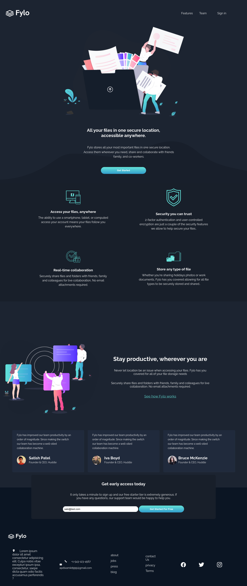

# Frontend Mentor - Fylo dark theme landing page solution

  - Active page [Click here to see landing page] (https://github.com/haamid10/30-days-of-code/tree/main/flylo-dark)  

## Table of contents

- [Overview](#overview)
  - [The challenge](#the-challenge)
  - [Screenshot](#screenshot)
  - [Links](#links)
- [My process](#my-process)
  - [Built with](#built-with)
  - [What I learned](#what-i-learned)
  - [Continued development](#continued-development)
  - [Useful resources](#useful-resources)
- [Author](#author)
- [Acknowledgments](#acknowledgments)


## Overview

### The challenge

Users should be able to:

- View the optimal layout for the site depending on their device's screen size
- See hover states for all interactive elements on the page
- View the optimal layout for the site depending on their device's screen size
- See hover states for all interactive elements on the page


### Screenshot




### Links

- Solution URL: 
- Live Site URL: (https://leafy-chimera-e2cf1b.netlify.app/)

## My process

### Built with

- Semantic HTML5 markup
- CSS custom properties
- Flex-box


### What I learned

i happy that I learned mobile section


```css
@media screen (max-width :375px) {
  header{
  color: papayawhip;
}
}
```

```


### Continued development

i want to focus on css flex-box section and would like to keep choosing


## Author

- Linkedin - [Hameedapdi](https://www.linkedin.com/in/hameed-apdi-6aa3a61a0/)
- Frontend Mentor - [@abdi hamiid](https://www.frontendmentor.io/profile/haamid10)
- Instagram - [@the.floriann](https://twitter.com/HameedApdi)
- Twitter - [@hameedapdi](https://twitter.com/HameedApdi)


